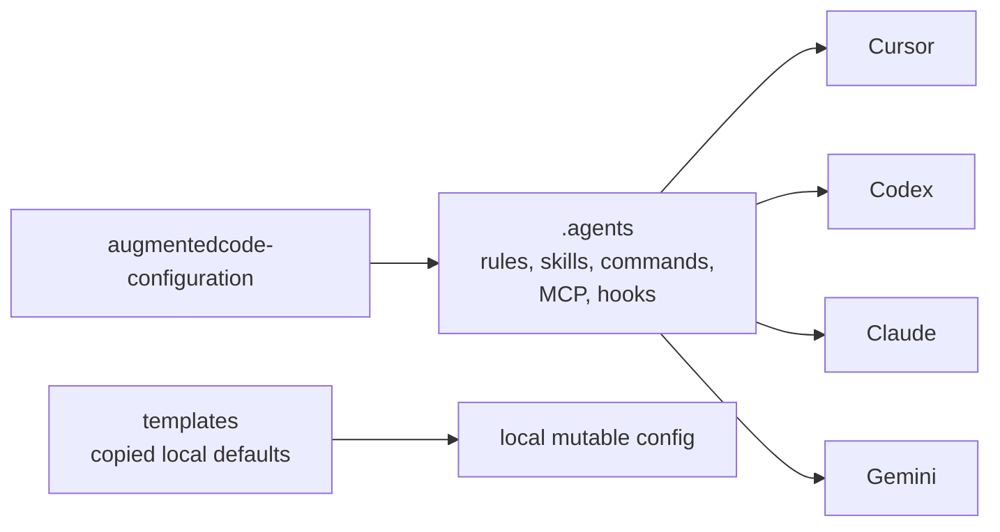

# Augmented Code Configuration

Shared AI-agent configuration for Cursor, Codex, Claude, Gemini, Antigravity, and related development workflows.

This repository is the source of truth for portable rules, skills, commands, MCP configuration, hooks, and setup scripts. Local tools consume it through symlinks, while mutable machine-specific config stays outside the repo or is seeded from `templates/`.

## Quick Start

```bash
cd ~/saski/augmentedcode-configuration
./setup-symlinks.sh setup
make install-hooks
make check
```

Use these checks while working:

| Need | Command |
|------|---------|
| Full local validation | `make check` |
| Symlink health | `./setup-symlinks.sh validate` |
| Skill catalog/index validation | `make validate-skills` |
| Shell syntax checks | `make lint-shell` |
| OpenSpec validation | `make validate-openspec` |
| Local config status | `./setup-symlinks.sh status` |

## Architecture



## Repository Map

```text
.
├── .agents/                  # Canonical shared agent assets
│   ├── rules/                # Universal and contextual rules
│   ├── skills/               # Native, imported, and sibling-repo skills
│   ├── commands/             # Shared slash-command prompts
│   ├── workflows/            # Structured delivery workflows
│   ├── hooks/                # Shared hook scripts, including RTK
│   ├── upstreams/            # Provenance for imported components
│   └── mcp.json              # Shared MCP server configuration
├── .cursor/                  # Cursor adapters and Cursor-only assets
├── .claude/                  # Claude shims to canonical shared assets
├── .gemini/                  # Gemini shims to canonical shared assets
├── docs/                     # Maintainer docs and OpenSpec artifacts
├── hooks/                    # Git hook templates
├── templates/                # Copied defaults for mutable local config
├── thoughts/                 # Shared research and implementation plans
├── src/thoughts/             # Thoughts CLI source
├── Makefile                  # Canonical validation targets
└── setup-symlinks.sh         # Setup, validation, and status for local links
```

## Canonical Assets

| Asset | Canonical path | Notes |
|-------|----------------|-------|
| Universal rules | `.agents/rules/base.md` | Also exposed through root `AGENTS.md`, `CLAUDE.md`, and `GEMINI.md` shims. |
| Contextual rules | `.agents/rules/*.md` | Python, Makefile, React, RTK, Codex defaults, and feedback-loop rules. |
| Skills | `.agents/skills/` | Native skills, imported packs, and sibling-repo skill references. |
| Skill routing docs | `.agents/docs/` | Use `skill-domain-routing.md` for routing and `skill-factory-skills.md` for inventory. |
| Commands | `.agents/commands/` | FIC commands plus project command prompts such as `review-pr`. |
| Workflows | `.agents/workflows/` | Context-driven development and TDD cycle workflows. |
| MCP config | `.agents/mcp.json` | Shared by configured tools. |
| Local tool shims | `~/.agents/bin` | Ignored by git and recreated by `./setup-symlinks.sh setup`. |

Maintainer details live in [docs/development-guide.md](docs/development-guide.md).

## Tool Wiring

`setup-symlinks.sh` connects local tool directories to the canonical assets:

| Tool | Managed links |
|------|---------------|
| Cursor | Rules, commands, skills, `.agents`, MCP config, CLI config, and Cursor-only skills. |
| Codex | Shared skills, Codex default rules, `AGENTS.md`, `RTK.md`, and copied `config.toml` defaults. |
| Claude | Commands, skills, hooks, `CLAUDE.md`, `RTK.md`, and copied `settings.json` defaults. |
| Gemini | Shared skills, `GEMINI.md`, and Antigravity MCP, command, and workflow links. |
| Antigravity and Langflow | Shared skills. |
| Global shell | `~/.agents`, `~/.agents/bin/rtk`, and `~/.agents/bin/openspec`. |

Mutable runtime state, such as Claude sessions, Cursor-managed manifests, Codex local config, and editor workspace state, intentionally stays out of the canonical repo.

## Daily Workflows

### Change Shared Configuration

```bash
./setup-symlinks.sh status
make check
./setup-symlinks.sh commit
```

### Refresh Skill-Factory Imports

```bash
./pull-and-sync-skills.sh --dry-run
./pull-and-sync-skills.sh
make validate-skills
```

`sync-skill-factory.sh` only refreshes skills listed in `.agents/upstreams/skill-factory/components.lock.json`; native and other external-pack skills are not overwritten.

### Install OpenSpec in a Consuming Repo

```bash
~/.agents/skills/openspec/scripts/install-openspec
```

The installer prefers `docs/openspec/`, then `thoughts/openspec/`, then root `openspec/`. This repo uses `docs/openspec/` with a root `openspec` symlink for CLI compatibility.

## FIC Workflow

FIC keeps long AI work understandable by moving through explicit phases and saving durable artifacts.


| Command or skill | Purpose |
|------------------|---------|
| `fic-research` | Capture current implementation facts without proposing changes. |
| `fic-create-plan` | Turn research or task context into a phased plan. |
| `fic-implement-plan` | Execute an approved plan with verification. |
| `fic-validate-plan` | Compare implementation evidence against the plan. |

Cursor and Claude can use command prompts from `.agents/commands/`. Codex, Gemini, and other tools should use the matching skills from `.agents/skills/`.

## Skills

All tools resolve shared skills from `.agents/skills/`. The README intentionally does not duplicate the full catalog.

Use these canonical indexes instead:

| Need | File |
|------|------|
| Domain-first routing | [.agents/docs/skill-domain-routing.md](.agents/docs/skill-domain-routing.md) |
| Full skill inventory | [.agents/docs/skill-factory-skills.md](.agents/docs/skill-factory-skills.md) |
| Engineering governance catalog | [.agents/skills/skill-foundry/agents/catalog-engineering.yaml](.agents/skills/skill-foundry/agents/catalog-engineering.yaml) |
| Product-management catalog | [.agents/skills/skill-foundry/agents/catalog-product-management.yaml](.agents/skills/skill-foundry/agents/catalog-product-management.yaml) |

Important local skill families include XP/TDD skills, FIC skills, OpenSpec, Context7 documentation lookup, GitHub host alias routing, vault/wiki tooling, and AI adoption guidance.

## Commands

Shared command prompts live in `.agents/commands/` and are mirrored into tool-specific command folders where supported.

| Command | Purpose |
|---------|---------|
| `/fic-research` | Research and document current codebase behavior. |
| `/fic-create-plan` | Create an implementation plan. |
| `/fic-implement-plan` | Execute a plan phase by phase. |
| `/fic-validate-plan` | Verify implementation completeness. |
| `/review-pr` | Guide an interactive PR review. |
| `/bug-fixing-agent` | Investigate and plan security-aware bug fixes. |
| `/install-command` | Install and customize command templates. |

## Thoughts

`thoughts/` stores durable research and plans:

```text
thoughts/
├── shared/
│   ├── research/
│   ├── plans/
│   └── prs/
└── searchable/               # Gitignored hardlinks created by the CLI
```

The optional CLI lives in `src/thoughts/`:

```bash
cd src/thoughts
npm install
npm run build
npx thoughts init
npx thoughts sync
```

## Troubleshooting

| Symptom | Fix |
|---------|-----|
| Symlinks are broken | Run `./setup-symlinks.sh setup`, then `./setup-symlinks.sh validate`. |
| `rtk` or `openspec` is missing in checks | Run `./setup-symlinks.sh setup` to recreate managed shims under `~/.agents/bin`. |
| Config is not loading in a tool | Run `./setup-symlinks.sh validate` and inspect the tool-specific link from the table above. |
| Skill validation fails after adding or moving a skill | Update the skill index, the relevant governance catalog, and routing docs in the same change. |
| A local template-backed config drifted | Re-copy the relevant file from `templates/`; mutable configs are not symlinked back into the repo. |

## Philosophy

These configurations optimize for:

- Think before acting.
- Make the simplest surgical change.
- Verify against explicit success criteria.
- Checkpoint, escalate, and disclose unresolved risks.
- Keep durable AI context in files instead of long transient chats.

## References

- [Development guide](docs/development-guide.md)
- [Skill domain routing](.agents/docs/skill-domain-routing.md)
- [Skill inventory](.agents/docs/skill-factory-skills.md)
- [Context Engineering Article](https://nikeyes.github.io/tu-claude-md-no-funciona-sin-context-engineering-es/)
- [stepwise-dev Plugin](https://github.com/nikeyes/stepwise-dev)
- [Ashley Ha Workflow](https://medium.com/@ashleyha/i-mastered-the-claude-code-workflow-145d25e502cf)

## License

[Unlicense](https://unlicense.org) - Public Domain
