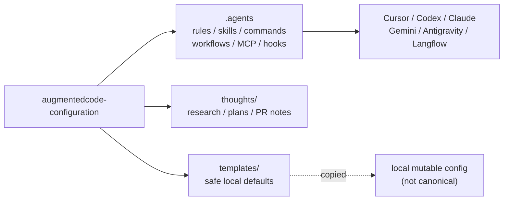
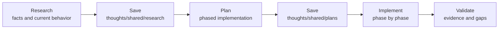

<h1 align="center">Augmented Code Configuration</h1>

<p align="center">
  A portable operating layer for AI-assisted development: shared rules, skills, commands, workflows, MCP config, hooks, and local setup conventions for Cursor, Codex, Claude, Gemini, Antigravity, and related tools.
</p>

<p align="center">
  <a href="https://github.com/saski/augmentedcode-configuration/blob/main/LICENSE">
    
  </a>
  
  
  
</p>

---

## Why this exists

AI coding tools are useful, but each one tends to grow its own private pile of rules, commands, memories, hooks, and local configuration. That becomes hard to audit and even harder to move between tools.

This repository keeps the reusable parts in one place.

The goal is not to create a giant prompt library. The goal is to keep a small, explicit, versioned configuration system that helps agents:

- think before acting;
- make the smallest safe change;
- use the right skill or workflow for the task;
- save durable research and plans outside transient chat context;
- verify work before claiming it is done.

## What you get

| Capability | What it gives you |
|------------|-------------------|
| Shared rules | A compact baseline rulebook plus contextual rules for specific kinds of work. |
| Shared skills | Portable task guidance for XP/TDD, FIC, OpenSpec, documentation lookup, PR review, vault/wiki work, AI adoption, and more. |
| Shared commands | Slash-command style prompts where the target tool supports them. |
| Shared MCP config | One canonical MCP configuration consumed by local tools. |
| Tool adapters | Cursor, Codex, Claude, Gemini, Antigravity, and Langflow wiring through symlinks or local template-backed files. |
| Durable context | `thoughts/` stores research, plans, and PR notes so long-running work does not depend on one overloaded chat. |
| Local validation | `make check` keeps symlinks, shell scripts, skills, OpenSpec artifacts, and tracked ignored files honest. |

## 30-second architecture



The important boundary: `.agents/` is canonical. Local runtime state, editor state, sessions, machine-specific paths, and mutable credentials stay outside the shared repo.

## Quick start

Clone this repository to the default location expected by the setup script:

```bash
git clone git@github.com-saski:saski/augmentedcode-configuration.git ~/Code/augmentedcode-configuration
cd ~/Code/augmentedcode-configuration
```

Set up local tool links and checks:

```bash
./setup-symlinks.sh setup
make install-hooks
make check
```

If you keep the repo somewhere else, run the script with an explicit path:

```bash
REPO_DIR=/path/to/augmentedcode-configuration ./setup-symlinks.sh setup
```

## Daily use

### Check the system

```bash
make check
```

That is the main local healthcheck. It runs tests, shell linting, skill validation, OpenSpec validation, symlink validation, and tracked-ignored reporting.

For narrower checks:

| Need | Command |
|------|---------|
| Full local validation | `make check` |
| Symlink health | `./setup-symlinks.sh validate` |
| Shared skill catalog/index validation | `make validate-skills` |
| Cursor-only skills validation | `make validate-cursor-skills` |
| Shell syntax checks | `make lint-shell` |
| OpenSpec validation | `make validate-openspec` |
| Local config status | `./setup-symlinks.sh status` |
| Local GitHub repo sync report | `make sync-saski-repos` |

### Change shared configuration

```bash
./setup-symlinks.sh status
make check
./setup-symlinks.sh commit
```

### Refresh imported skills

```bash
./pull-and-sync-skills.sh --dry-run
./pull-and-sync-skills.sh
make validate-skills
```

Imported `skill-factory` components are refreshed only from `.agents/upstreams/skill-factory/components.lock.json`. Native skills and other external skill packs are not overwritten by that sync.

### Sync local GitHub repos

```bash
make sync-saski-repos
make sync-saski-repos-apply
./sync-saski-repos.sh --discover
```

The sync script uses [saski-github-repos.tsv](saski-github-repos.tsv) as an explicit manifest for GitHub repos under `~/Code`. It fetches source refs and fast-forwards only clean matching branches; dirty, detached, wrong-branch, and diverged worktrees are reported and left untouched. Forks can be pushed back to their fork remotes only when `--push` is passed explicitly.

## Repository map

```text
.
├── .agents/                  # Canonical shared agent assets
│   ├── rules/                # Universal and contextual rules
│   ├── skills/               # Native, imported, and sibling-repo skills
│   ├── commands/             # Shared slash-command prompts
│   ├── workflows/            # Structured delivery workflows
│   ├── hooks/                # Shared hook scripts, including RTK
│   ├── upstreams/            # Provenance for imported components
│   └── mcp.json              # Shared MCP server configuration
├── .cursor/                  # Cursor adapters; skills-cursor/ for IDE-only skills
├── .claude/                  # Claude shims to canonical shared assets
├── .gemini/                  # Gemini shims to canonical shared assets
├── docs/                     # Maintainer docs and OpenSpec artifacts
├── hooks/                    # Git hook templates
├── templates/                # Copied defaults for mutable local config
├── thoughts/                 # Shared research and implementation plans
├── src/thoughts/             # Optional thoughts CLI source
├── Makefile                  # Canonical validation targets
├── saski-github-repos.tsv    # Manifest for local GitHub repo sync
├── sync-saski-repos.sh       # Safe fast-forward sync for ~/Code repos
└── setup-symlinks.sh         # Setup, validation, and status for local links
```

Maintainer-facing details live in [docs/development-guide.md](docs/development-guide.md).

## Canonical assets

| Asset | Canonical path | Notes |
|-------|----------------|-------|
| Universal rules | `.agents/rules/base.md` | Also exposed through root `AGENTS.md`, `CLAUDE.md`, and `GEMINI.md` shims. |
| Contextual rules | `.agents/rules/*.md` | Python, Makefile, React, Codex defaults, feedback loop, and other scoped rules. RTK guidance is embedded in `base.md` §8. |
| Shared skills | `.agents/skills/` | Native skills, imported packs, and sibling-repo skill references. |
| Cursor-only skills | `.cursor/skills-cursor/` | Canvas, SDK, loops, and meta-skills; see `cursor-skills.md`. |
| Skill routing docs | `.agents/docs/` | `skill-domain-routing.md` and `skill-factory-skills.md` for shared skills; `cursor-skills.md` for Cursor-only. |
| Commands | `.agents/commands/` | FIC commands plus project command prompts such as `review-pr`. |
| Workflows | `.agents/workflows/` | Context-driven development and TDD cycle workflows. |
| MCP config | `.agents/mcp.json` | Shared by configured tools. |
| Local tool shims | `~/.agents/bin` | Ignored by git and recreated by `./setup-symlinks.sh setup`. |

## Tool wiring

`setup-symlinks.sh` connects local tool directories to the canonical assets:

| Tool | Managed links |
|------|---------------|
| Cursor | Rules, commands, skills, `.agents`, MCP config, CLI config, and Cursor-only skills. |
| Codex | Shared skills, Codex default rules, `AGENTS.md`, copied `config.toml` and `hooks.json` defaults, plus `~/.codex/hooks/rtk-rewrite.sh` for Bash command rewriting through RTK. |
| Claude | Commands, skills, hooks, and copied `settings.json` defaults. The universal rulebook reaches Claude Code via `~/CLAUDE.md` → `base.md`; Bash hooks use the shared RTK rewrite script. |
| Gemini | Shared skills, `GEMINI.md`, plus Antigravity MCP, command, and workflow links. |
| Antigravity and Langflow | Shared skills. |
| Global shell | `~/.agents`, `~/.agents/bin/rtk`, and `~/.agents/bin/openspec`. |

Mutable runtime state, such as Claude sessions, Cursor-managed manifests, Codex local config, and editor workspace state, intentionally stays out of the canonical repo.

## FIC workflow

FIC keeps long AI work understandable by moving through explicit phases and saving durable artifacts between context windows.



| Command or skill | Purpose |
|------------------|---------|
| `fic-research` | Capture current implementation facts without proposing changes. |
| `fic-create-plan` | Turn research or task context into a phased plan. |
| `fic-implement-plan` | Execute an approved plan with verification. |
| `fic-validate-plan` | Compare implementation evidence against the plan. |

Cursor and Claude can use command prompts from `.agents/commands/`. Codex, Gemini, and other tools should use the matching skills from `.agents/skills/`.

## Skills and commands

The README intentionally does not duplicate the full catalog. Use the canonical indexes instead:

| Need | File |
|------|------|
| Domain-first routing | [.agents/docs/skill-domain-routing.md](.agents/docs/skill-domain-routing.md) |
| Full skill inventory | [.agents/docs/skill-factory-skills.md](.agents/docs/skill-factory-skills.md) |
| Engineering governance catalog | [.agents/skills/skill-foundry/agents/catalog-engineering.yaml](.agents/skills/skill-foundry/agents/catalog-engineering.yaml) |
| Product-management catalog | [.agents/skills/skill-foundry/agents/catalog-product-management.yaml](.agents/skills/skill-foundry/agents/catalog-product-management.yaml) |

Common command entry points:

| Command | Purpose |
|---------|---------|
| `/fic-research` | Research and document current codebase behavior. |
| `/fic-create-plan` | Create an implementation plan. |
| `/fic-implement-plan` | Execute a plan phase by phase. |
| `/fic-validate-plan` | Verify implementation completeness. |
| `/lustra` | Run structured code-health and due-diligence checks across security, dependencies, tests, design, docs, CI, and structure. |
| `/review-pr` | Guide an interactive PR review. |
| `/bug-fixing-agent` | Investigate and plan security-aware bug fixes. |
| `/install-command` | Install and customize command templates. |

## Thoughts

`thoughts/` stores durable research and plans:

```text
thoughts/
├── shared/
│   ├── research/
│   ├── plans/
│   └── prs/
└── searchable/               # Gitignored hardlinks created by the CLI
```

The optional CLI lives in `src/thoughts/`:

```bash
cd src/thoughts
npm install
npm run build
npx thoughts init
npx thoughts sync
```

## OpenSpec in a consuming repo

Install the shared OpenSpec skill from the canonical global skill path:

```bash
~/.agents/skills/openspec/scripts/install-openspec
```

The installer prefers `docs/openspec/`, then `thoughts/openspec/`, then root `openspec/`. This repository uses `docs/openspec/` with a root `openspec` symlink for CLI compatibility.

## Troubleshooting

| Symptom | Fix |
|---------|-----|
| Symlinks are broken | Run `./setup-symlinks.sh setup`, then `./setup-symlinks.sh validate`. |
| `rtk` or `openspec` is missing in checks | Run `./setup-symlinks.sh setup` to recreate managed shims under `~/.agents/bin`. |
| Config is not loading in a tool | Run `./setup-symlinks.sh validate` and inspect the tool-specific link from the table above. |
| Skill validation fails after adding or moving a skill | Update the skill index, the relevant governance catalog, and routing docs in the same change. |
| A local template-backed config drifted | Re-copy the relevant file from `templates/`; mutable configs are not symlinked back into the repo. |

## Design principles

These configurations optimize for:

1. **Think before acting** - inspect the task, constraints, and relevant context before changing files.
2. **Simplest surgical change** - prefer small, reversible, auditable edits.
3. **Goal-driven verification** - prove the requested outcome, not just that a command happened to pass.
4. **Checkpoint and escalate** - disclose uncertainty, risks, and incomplete evidence.
5. **Durable context over chat memory** - keep research, plans, and decisions in files that can be reviewed.

## References

- [Development guide](docs/development-guide.md)
- [Skill domain routing](.agents/docs/skill-domain-routing.md)
- [Skill inventory](.agents/docs/skill-factory-skills.md)
- [Context Engineering Article](https://nikeyes.github.io/tu-claude-md-no-funciona-sin-context-engineering-es/)
- [stepwise-dev Plugin](https://github.com/nikeyes/stepwise-dev)
- [Ashley Ha Workflow](https://medium.com/@ashleyha/i-mastered-the-claude-code-workflow-145d25e502cf)

## License

[Unlicense](https://unlicense.org) - Public Domain.
