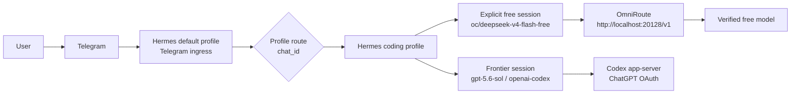
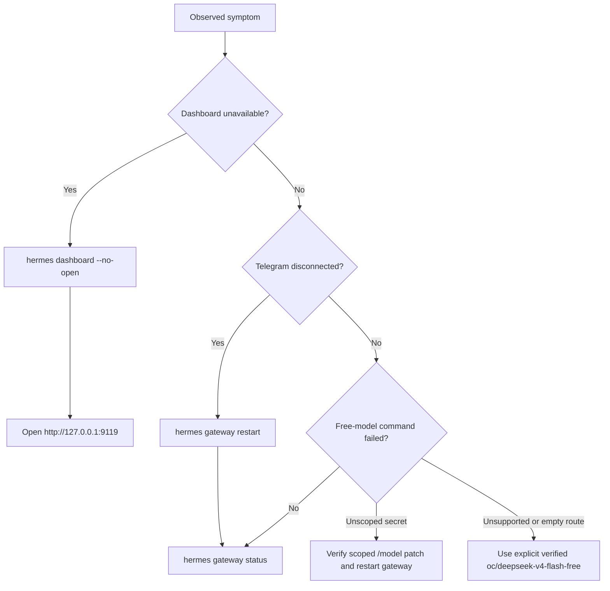

# Hermes, OmniRoute, and Telegram Operations

**Verified locally:** 2026-07-30

This runbook records the current local deployment. It is intentionally not a
managed configuration template: credentials, Telegram pairing, session state,
and local Hermes source changes remain outside this repository.

## Operating model



The Telegram bot is connected only by the default profile. The profile route
selects `coding` for the configured chat, where a turn runs with that profile's
configuration and secret scope. The `coding` profile MUST keep its Telegram
platform disabled when it shares the bot credential with `default`; two
adapters cannot poll the same Telegram bot token.

## Model lanes

| Lane | Use for | Provider and model | Selection |
|---|---|---|---|
| Frontier | Planning, SDD, orchestration, integration, sensitive or ambiguous work | `openai-codex` / `gpt-5.6-sol` | Default after `/new` |
| Free | Bounded, non-sensitive, verifiable work | `custom` / `oc/deepseek-v4-flash-free` | Explicit, session-only |

`/new` clears session overrides. In the routed `coding` profile it therefore
starts again on `gpt-5.6-sol` through `openai-codex`.

Do not use `free-stack`, `free-deterministic`, or broad `auto/*` aliases as an
operational default. They have produced unsupported-model errors or
semantically empty responses. OpenCode worker configuration uses
`omniroute/oc/...` identifiers; Hermes calls the OpenAI-compatible endpoint
with the raw `oc/...` identifier.

## Telegram procedure

Send every command as a separate Telegram message and wait for its reply. Do
not paste `/new` and `/model` into one message: Hermes treats text following
`/new` as a session title.

### Frontier session

```text
/new
```

Expected result: `gpt-5.6-sol` with provider `openai-codex`.

### Explicit free session

```text
/new
```

Wait for the reset confirmation, then send:

```text
/model oc/deepseek-v4-flash-free --provider custom
```

Expected result: `Model switched to oc/deepseek-v4-flash-free` with provider
`OmniRoute local`. A minimal non-sensitive smoke prompt is:

```text
Reply with exactly: RUTA_FREE_OK
```

Use `--global` only after an explicit decision to make the profile default
free. The recommended configuration keeps the frontier default and requires a
deliberate free selection per session.

To return to frontier within the current session:

```text
/model gpt-5.6-sol --provider openai-codex
```

## Local configuration boundary

The local files are machine state and MUST NOT be copied into this repository:

| Purpose | Local path |
|---|---|
| Default ingress profile | `~/.hermes/config.yaml` and `~/.hermes/.env` |
| Routed coding profile | `~/.hermes/profiles/coding/config.yaml` and `~/.hermes/profiles/coding/.env` |
| Mutable Hermes implementation | `~/.hermes/hermes-agent/` |

The named custom provider `omniroute-local` uses
`http://localhost:20128/v1`, `key_env: OMNIROUTE_API_KEY`, and raw model ID
`oc/deepseek-v4-flash-free`. The local key is a transport placeholder for the
loopback endpoint, not an OpenAI, Codex, or upstream provider credential.

## Multiplex secret-scope fix

In a multiplexed gateway, `get_secret()` deliberately fails outside a profile
scope. Hermes' typed `/model <id> --provider custom` previously resolved the
provider before entering that scope, producing:

```text
get_secret('OMNIROUTE_API_KEY') called with no profile secret scope active
```

The local Hermes source now wraps the full `/model` handler in the routed
profile's `_profile_runtime_scope`. This preserves secret isolation and lets
the command resolve `OMNIROUTE_API_KEY` from the `coding` profile only. The
patch needs an upstream Hermes release or a maintained local patch before any
future Hermes source upgrade.

## Health and recovery



Useful local checks:

```bash
hermes gateway status
hermes gateway list
hermes dashboard --status
curl --fail http://127.0.0.1:20128/v1/models
```

`hermes gateway status` should report a launchd-supervised gateway. A manual
detached process can retain old environment values; use `hermes gateway restart`
after changing a profile configuration.

WhatsApp is optional and independent of Telegram. Set `WHATSAPP_ENABLED=false`
in both active profile `.env` files if it is not in use, then restart the
gateway. Do not record phone numbers, bot tokens, or paired-session files in
repository documentation.

## Verification and remaining gaps

- Verified: Telegram ingress, routed `coding` frontier reset, explicit Hermes
  free-model switch, and a non-sensitive `RUTA_FREE_OK` completion.
- Verified: the dashboard responds on `127.0.0.1:9119` while its process is
  running.
- Not yet managed by this repository: idempotent Hermes/OpenCode templates and
  installation checks.
- Quarantined: the six catalogued `opencode-zen/*` free models failed individual
  OpenCode conformance on 2026-07-30. They must not be used until a future
  catalog change is followed by a fresh passing conformance run.
- Verified through the worker adapter: OpenCode completed a bounded, one-shot
  request against `omniroute/oc/deepseek-v4-flash-free`, returned a structured
  result, changed only its allowed file, and passed its declared validation.
- The worker uses a constrained OpenCode agent (`read` and `edit` only, three
  steps). Three bounded smokes used 20,082–20,509 input tokens, versus the
  90,297-token baseline, on 2026-07-30; keep this configuration for bounded
  free edits.
