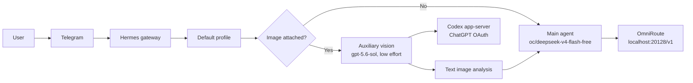
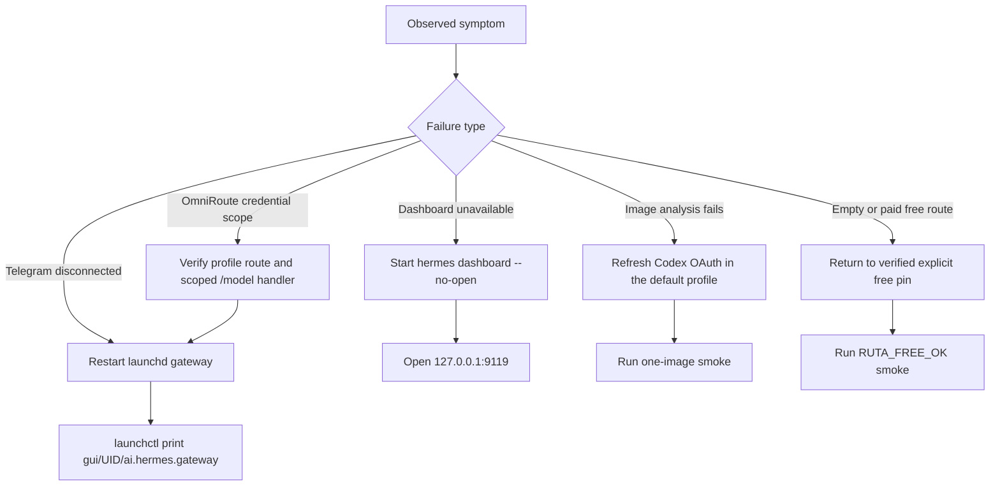

# Hermes, OmniRoute, and Telegram Operations

**Verified locally:** 2026-08-11

This runbook records the intended secret-free routing policy. The reusable
overlay is versioned at
[`templates/hermes/dynamic-routing.overlay.yaml`](../templates/hermes/dynamic-routing.overlay.yaml).
Credentials, OAuth state, Telegram identifiers, sessions, and paired-channel
state remain local machine data and are never committed.

## Operating model



The normal Telegram path is free. An image triggers exactly one frontier
preprocessing call; Hermes converts its visual analysis to text and sends that
text to the free main model. The Telegram toolset intentionally omits the
explicit `vision` tool because automatic image preprocessing already handles
the attachment and a second tool call would duplicate frontier consumption.

## Model lanes

| Lane | Use for | Provider and model | Selection |
|---|---|---|---|
| Default text | Ordinary chat and bounded, non-sensitive work | `omniroute` / `oc/deepseek-v4-flash-free` | Automatic after `/new` |
| Automatic image analysis | Inspecting an attached image before free reasoning | `openai-codex` / `gpt-5.6-sol`, low effort | Automatic only when an image is present |
| Full frontier | Planning, SDD, orchestration, sensitive or ambiguous work | `openai-codex` / `gpt-5.6-sol` | Explicit model switch or dedicated profile |

`/new` clears session overrides and starts the default free model. `/status`
continues to report the free main model after an image turn; auxiliary vision
is a preprocessing call, not the session model.

Do not promote broad `auto/*`, `free-stack`, or `free-deterministic` aliases as
the operational default without a fresh semantic conformance test. A catalog
entry or HTTP 200 response is insufficient; the route must return usable
content for the requested task.

## Managed routing overlay

The repository overlay captures only portable policy. It is deliberately not
a complete Hermes configuration and MUST be merged into `~/.hermes/config.yaml`
rather than copied over it.

Before using it on another machine:

1. Replace `REPLACE_WITH_TELEGRAM_CHAT_ID` locally with the allowed Telegram
   chat identifier.
2. Keep `OMNIROUTE_API_KEY`, the Telegram bot token, and Codex OAuth state in
   the local profile environment or authentication stores.
3. Preserve unrelated local platform, memory, terminal, and sandbox settings.
4. Restart the launchd-supervised gateway and run the text and image smokes
   below.

The relevant machine-state boundary is:

| Purpose | Local path |
|---|---|
| Default ingress profile | `~/.hermes/config.yaml` and `~/.hermes/.env` |
| Optional named profiles | `~/.hermes/profiles/<profile>/config.yaml` and `.env` |
| Codex OAuth state | Hermes/Codex authentication stores |
| Mutable Hermes implementation | `~/.hermes/hermes-agent/` |

Never commit phone numbers, chat identifiers, bot tokens, provider keys,
session databases, paired-channel files, or OAuth credentials.

## Telegram procedure

Send every command as a separate Telegram message and wait for its reply. Do
not paste `/new` and `/model` into one message: Hermes treats text following
`/new` as a session title.

### Default free session

```text
/new
```

Expected result: `oc/deepseek-v4-flash-free` through the OmniRoute provider.
A minimal smoke prompt is:

```text
Reply with exactly: RUTA_FREE_OK
```

### Explicit full-frontier session

```text
/model gpt-5.6-sol --provider openai-codex
```

Use this for work that requires frontier planning or orchestration. The model
override is session-only unless `--global` is supplied; avoid `--global` when
the desired default remains free.

Return to the free main model with:

```text
/model oc/deepseek-v4-flash-free --provider custom
```

## Multiplex secret scope

In a multiplexed gateway, `get_secret()` deliberately fails outside a profile
scope. A failure such as:

```text
get_secret('OMNIROUTE_API_KEY') called with no profile secret scope active
```

means provider resolution escaped the routed profile's runtime scope. The
current local Hermes implementation wraps the `/model` handler in the routed
profile scope. Re-check this behavior after any Hermes source upgrade until
the fix is supplied by an upstream release.

## Health and recovery



Useful local checks:

```bash
launchctl print "gui/$(id -u)/ai.hermes.gateway"
hermes gateway list
hermes dashboard --status
curl --fail http://127.0.0.1:20128/v1/models
```

`hermes gateway status` may lag behind launchd state; `launchctl print` is the
authoritative local process check. After a configuration change, restart the
supervised process rather than leaving a detached gateway with stale
environment values.

If Codex OAuth has expired, authenticate or run one direct Codex-backed Hermes
turn in the default profile before retrying image preprocessing. Keep this
recovery local; no OAuth artifact belongs in Git.

WhatsApp is optional and independent of Telegram. Keep
`WHATSAPP_ENABLED=false` in every active profile when it is unused, restart the
gateway, and confirm that no WhatsApp adapter is listed.

## Verification record

- The Telegram route selects the `default` profile.
- A text-only turn uses `oc/deepseek-v4-flash-free` through OmniRoute.
- A one-image smoke produced one auxiliary `gpt-5.6-sol` analysis followed by
  one free DeepSeek completion; the free main call used 2,477 input and 44
  output tokens.
- The launchd gateway was running and Telegram reconnected in polling mode.
- The committed regression test checks the free default, automatic low-effort
  frontier vision, default profile route, absence of the duplicate `vision`
  tool, and absence of common credential or personal-identifier patterns.
- OpenCode free workers remain a separate, bounded adapter path; this Hermes
  overlay does not make arbitrary OpenCode models trusted workers.
