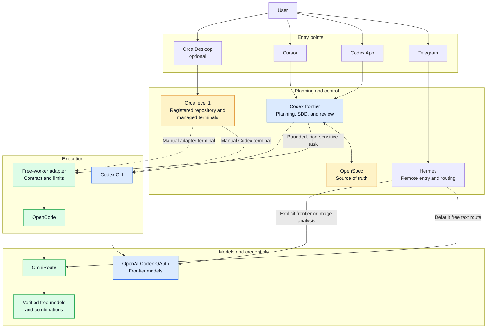
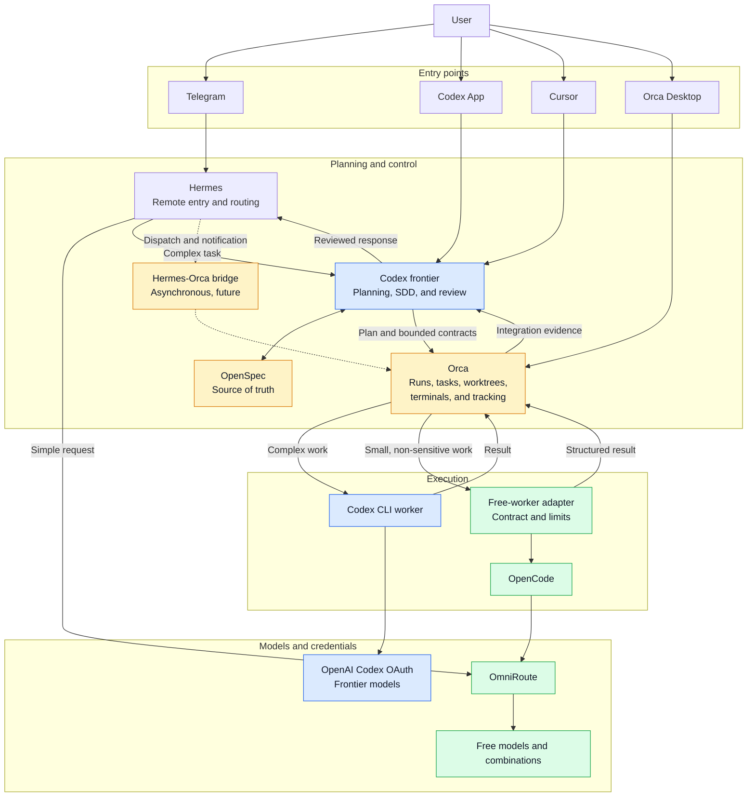

# Local Agentic Development Architecture

**Current state verified:** 2026-08-12

**Adoption level:** Orca level 1 — optional visual workspace and managed
terminals

This document separates the architecture that is operational today from the
possible target architecture. A target connection MUST NOT be treated as
implemented merely because it appears in a diagram.

## Design principles

- Codex frontier agents own planning, SDD, task slicing, integration, and final
  review.
- OpenSpec is the durable source of truth for requirements and delivery state.
- Bounded, non-sensitive execution may use OpenCode through the free-worker
  adapter and an explicitly verified free OmniRoute route.
- Hermes is the remote Telegram entry point and may also execute explicit free
  or frontier turns using its own configured provider boundary.
- Orca is optional. Closing Orca MUST NOT interrupt Hermes, Telegram, Codex,
  OpenCode, or OmniRoute.
- Credentials stay with the runtime that consumes them. No OAuth token or API
  key belongs in the repository or in OmniRoute routing policy.

## Current architecture

### Verified current state

| Component | Current role | Verification or boundary |
|---|---|---|
| Hermes and Telegram | Persistent remote entry | The launchd gateway is independent from Orca |
| Codex App and CLI | Frontier planning, implementation, and review | Existing ChatGPT OAuth is the Codex credential source |
| OpenSpec | Requirements and delivery source of truth | Repository-managed specifications and tasks |
| Free-worker adapter | Bounded OpenCode execution | Fixed free route, explicit file scope, no paid fallback, structured result |
| OpenCode | Free tactical worker | Invoked through the adapter for governed work |
| OmniRoute | Local provider gateway | Free routes require semantic smoke verification, not only HTTP success |
| Orca 1.4.180 | Optional repository and terminal UI | Repository registered; Codex selected; existing OAuth detected; global Orca hooks disabled; zero-token terminal smoke passed |
| Cursor | Alternative local entry surface | No Orca-specific integration is enabled |

There is currently no Hermes-to-Orca bridge, no automatic Orca task creation,
and no Orca-owned routing decision. Orca can be closed without affecting the
rest of the system.

## Target architecture

This target becomes relevant only if the level-1 trial demonstrates recurring
value from supervised parallel execution, long-running tasks, or worktree
visibility.

Dashed edges are future asynchronous integration. They are intentionally not
part of the current critical path. A synchronous Telegram request MUST NOT wait
for a long-running Orca worker because that would reintroduce gateway and model
turn timeouts.

## Promotion gate for deeper Orca integration

Evaluate Orca across five real development tasks. Promote beyond level 1 only
if at least three tasks demonstrate one or more of these benefits:

- two or more concurrent agents were materially easier to supervise;
- separate worktrees prevented a real checkout or attribution conflict;
- a task longer than ten minutes remained observable and recoverable;
- Orca made terminal ownership or execution results materially clearer; or
- Orca recovered or diagnosed an execution that would otherwise have remained
  uncertain.

Until that evidence exists, do not add the Hermes-Orca bridge, automatic task
mirroring, another routing policy, or Orca-managed global agent hooks.
