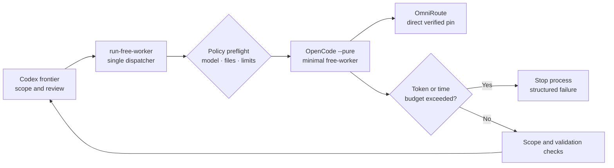

## Decision

The existing `run-free-worker` public interface remains the only supported
frontier-to-free dispatch path. Strengthening that boundary is simpler and less
error-prone than adding a new command that could drift from the adapter.

Each task class owns three limits in `.agents/free-agent-routing.json`:

| Limit | Initial `bounded_code` value | Purpose |
|---|---:|---|
| `max_steps` | 3 | Keep the OpenCode agent loop bounded |
| `max_input_tokens` | 50000 | Stop repeated oversized-context calls |
| `max_timeout_seconds` | 180 | Bound wall-clock occupancy |

The adapter generates the ephemeral OpenCode agent's `maxSteps` from policy,
monitors emitted `step_finish` events while the process is running, and kills
the process once cumulative input usage exceeds the task-class ceiling. It
also checks usage after process exit so a fast oversized completion cannot be
accepted accidentally.

The stable result adds `termination_reason` so the frontier can distinguish a
budget breach from timeout, provider failure, missing completion, scope
violation, or validation failure without parsing diagnostic prose.

Edit contracts may set `require_changes: true`. A run with no newly attributed
files then fails with `termination_reason: required_changes_missing`, even if
OpenCode returns a non-empty explanation. This closes the semantic gap observed
when a three-step worker inspected files, made no edit, and was previously
accepted because generic completion text was allowed.

## Routing Policy

`omniroute/oc/deepseek-v4-flash-free` remains the default direct pin and
`omniroute/oc/big-pickle` remains a manual alternative for a fresh worktree.
`free-deterministic` is active in the live OmniRoute catalog but remains a
candidate route because its 2026-08-06 semantic probe failed at a billed
pipeline member. Catalog activity and semantic health are separate gates.

No failure triggers a paid fallback or an automatic second worker. The Codex
frontier reviews the structured failure and decides the next safe action.

## Flow

## Trade-offs

- The first oversized call can cross the ceiling before usage becomes visible,
  but subsequent 100k-token iterations are prevented.
- A 50k ceiling is above the measured 20,082-20,509-token bounded smokes and a
  30,707-token large-test inspection while remaining below the observed
  80k-150k failure range.
- Hard limits may reject a legitimate broad task; that is intentional because
  broad tasks belong on the frontier lane or must be split further.
