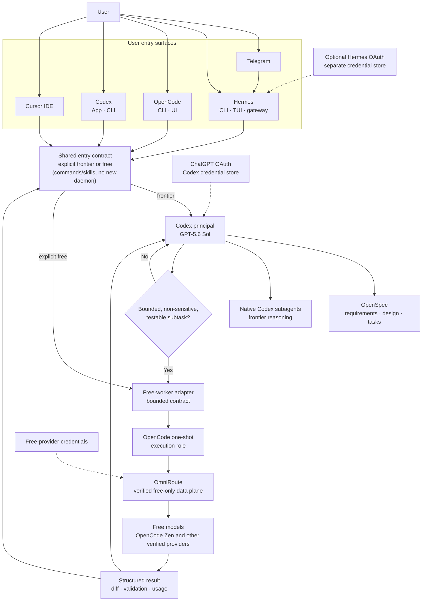

## Context

The local environment currently has four desired user entry surfaces and three verified runtimes:

- Codex App/CLI is authenticated directly to the user's ChatGPT account and defaults to `gpt-5.6-sol`.
- OpenCode can complete one-shot agent work through OmniRoute with explicit models such as `omniroute/oc/deepseek-v4-flash-free` and `omniroute/oc/big-pickle`.
- Hermes can enter through CLI, TUI, or Telegram. It can hand OpenAI/Codex turns to a Codex app-server subprocess, or complete free work through OmniRoute when an explicit working model is selected. Its current default `auto/best-coding` route resolves to an unhealthy upstream that returns semantically empty HTTP 200 responses.
- Cursor is installed as an IDE and already consumes this repository's shared rules and skills, although its `cursor` shell command is not currently on `PATH`.

OmniRoute knows a broad and changing model catalog. Its local static client configuration includes stale model identifiers, its OpenCode Zen connection health can be invalidated by testing an unsupported model, and its Chat Completions bridge is not a reliable path for Responses-native GPT-5.6 models. These facts make OmniRoute valuable as a free-model gateway but unsuitable as the control plane for paid frontier work.

The user's OpenAI account and the OpenAI API are separate credential and billing surfaces. A Codex/ChatGPT account can be used directly by Codex, but it must not be treated as a reusable API key for Hermes or another OpenAI-compatible client. A separate API key could enable that path, but it is not required by this design.

## Goals / Non-Goals

**Goals:**

- Use frontier Codex agents for requirements, planning, SDD, orchestration, risky judgment, integration, and final verification.
- Allow Hermes, OpenCode, Codex App/CLI, and Cursor to initiate the same logical workflow.
- Use free models for bounded execution work when the task and context are suitable.
- Keep entry selection separate from orchestration ownership.
- Give Codex one stable, observable handoff mechanism for free workers.
- Maximize the useful OmniRoute free catalog without allowing unverified model churn to break the default workflow.
- Keep secrets, paid models, and sensitive source out of the free-model path.
- Make every delegated result reviewable against an OpenSpec artifact and an explicit verification contract.
- Keep the first release small enough to implement and validate in one to three days.

**Non-Goals:**

- Running GPT-5.6 through OmniRoute or OpenCode.
- Making Hermes, OpenCode, or Cursor a second orchestration owner inside a Codex-controlled run.
- Automatically inferring `frontier` versus `free` at every entry surface in the initial release.
- Centralizing ChatGPT/Codex OAuth in OmniRoute.
- Making external free workers appear as native Codex subagents.
- Building a new gateway service, distributed scheduler, queue, or MCP server.
- Automatically routing from a free model to a paid model.
- Supporting every model advertised by OmniRoute without individual conformance testing.
- Parallel writes by multiple workers into the same worktree.

## Decisions

### 1. Multiple entry surfaces, one frontier owner per run

Hermes, OpenCode, Codex App/CLI, and Cursor may all initiate work. Entry location is a user-interface concern; it does not determine orchestration ownership. Each entry uses one of two explicit modes:

| Mode | Meaning | Owner |
|---|---|---|
| `frontier` | Start or continue an orchestrated Codex run | Codex principal |
| `free` | Execute one bounded, non-sensitive task without a nested plan | OpenCode one-shot worker |

Inside a `frontier` run, Codex owns the task goal, OpenSpec artifacts, decomposition, worker selection, progress tracking, integration, and final acceptance. `gpt-5.6-sol` is the default principal for demanding work. Native Codex agents remain the preferred delegation path when a subtask requires frontier reasoning, sensitive context, or tight interaction with Codex tools.

The initial release does not use an LLM at the edge to choose a mode. The user selects it explicitly; Codex may then delegate bounded work from a `frontier` run. This prevents route loops and keeps failures attributable.

### 2. OpenSpec is the durable SDD contract

The Codex principal will create or update the relevant OpenSpec proposal, capability spec, design, and task list before delegating implementation work. A free worker receives only:

- one bounded task identifier;
- the relevant requirement and scenario;
- the necessary file scope;
- explicit allowed actions;
- the expected tests or validation;
- a concise completion schema.

The worker does not reinterpret the product goal or rewrite the architecture. Any ambiguity returns to the Codex principal.

### 3. OpenCode is the default free-worker runtime

Codex invokes a repository-managed adapter that calls OpenCode in deterministic one-shot mode:

```text
Codex -> free-worker adapter -> opencode run -> OmniRoute -> verified free model
```

OpenCode is retained because this exact path has been verified locally and it already provides an agent runtime, model selection, working-directory control, and structured JSON events. It does not choose paid OpenAI models and does not spawn another orchestration tree.

The adapter, not a second LLM, owns the mechanical boundary: input validation, process timeout, output parsing, usage capture, and conversion to a stable handoff result.

### 4. OmniRoute is the free-model data plane

OmniRoute owns access to free upstream providers and, after semantic health checks are reliable, routing within explicit free-only task classes. It must not receive the user's OpenAI or OpenCode Zen paid credential for this workflow.

The first release uses direct verified model pins:

| Task class | Initial model | Status |
|---|---|---|
| bounded code implementation | `oc/deepseek-v4-flash-free` | Verified through Hermes and OmniRoute |
| fallback or general worker | `oc/big-pickle` | Verified through OpenCode and Hermes |

The local catalog's other free models remain candidates, not production routes. Each candidate must pass the same conformance suite before it is added.

Broad built-in routes such as `auto/best-coding` and `auto/best-free` are excluded from the initial worker path because their membership and semantic health are not controlled by this repository.

### 5. Entry adapters are thin and do not form a new gateway

The shared entry contract is implemented through commands, skills, and existing client capabilities rather than a new daemon or protocol gateway:

| Entry surface | `frontier` path | Explicit `free` path |
|---|---|---|
| Codex App/CLI | Native Codex session | Codex invokes the free-worker adapter |
| Hermes CLI/TUI/Telegram | Hermes Codex app-server runtime | Hermes invokes an explicit verified OmniRoute route |
| OpenCode | Thin command/skill hands off the parent request to Codex | OpenCode one-shot through OmniRoute |
| Cursor IDE | Shared command/skill starts Codex in the repository | Shared command/skill invokes the free-worker adapter |

Hermes is the recommended remote ingress because its supervised Telegram gateway is already operational. On Codex app-server turns, Hermes remains the session and messaging shell while Codex owns shell execution, patching, sandboxing, plugins, and the model turn. Hermes delegation does not wrap or compete with the Codex principal.

OpenCode remains the worker boundary even when the user entered through OpenCode; a loop guard and explicit execution role prevent a Codex handoff from recursively treating the parent OpenCode session as its own worker.

### 6. OAuth stays with the runtime that consumes it

The frontier path uses two deliberately separate credential stores:

| Credential | Stored by | Used for | Required |
|---|---|---|---|
| Codex ChatGPT OAuth | Codex CLI/App | Codex App/CLI and Hermes Codex app-server LLM calls | Yes for the recommended frontier path |
| Hermes `openai-codex` OAuth | Hermes | Hermes-native `codex_responses` calls and auxiliary Hermes behavior | Optional for the main app-server turn; recommended for the cleanest Hermes UX |
| OpenCode Zen credential | OmniRoute/OpenCode local state | Verified free OpenCode Zen models | Yes only for those free routes |

The current Codex CLI already reports `Logged in using ChatGPT`. Hermes must not copy `~/.codex/auth.json`; Hermes intentionally keeps its own OAuth refresh state to avoid token-refresh conflicts. If Hermes-native OpenAI/Codex behavior is enabled, authenticate it with `hermes auth add openai-codex --type oauth`.

OmniRoute is not the correct location for either Codex OAuth session. Putting frontier credentials there would turn the free-model data plane into a paid shared identity proxy, expand the secret blast radius, and make billing and approvals harder to attribute.

### 7. Task routing is policy-based, not model-name based

The principal classifies work before delegation:

| Work type | Execution lane |
|---|---|
| Requirements, architecture, OpenSpec design, task slicing | Codex `gpt-5.6-sol` |
| Security, privacy, credentials, destructive operations | Codex frontier only |
| Ambiguous debugging or cross-cutting integration | Codex frontier; native frontier subagents when useful |
| Read-heavy exploration with sensitive or large context | Native Codex subagent, typically a faster frontier model |
| Bounded implementation with explicit acceptance tests | Free worker through OpenCode and OmniRoute |
| Mechanical test, formatting, or documentation update | Free worker when context is non-sensitive |
| Final diff review and acceptance | Codex frontier |

Model availability may change without changing these roles.

### 8. Semantic success is required

A worker run is successful only when all of the following are true:

- the process completed without a transport or provider error;
- the selected model is in the verified free allowlist;
- the response contains non-empty final content;
- the worker returns the required structured completion fields;
- declared validation actually ran and its status is reported;
- changed files stay inside the allowed scope.

An HTTP 200, a zero exit code, or a synthetic `finish_reason` is insufficient by itself. Empty content, zero-token completions, missing final output, or an unsupported-model response are failures.

The initial adapter returns failures to Codex. It does not silently retry a paid model. A second free model may be attempted only when the routing policy explicitly lists it for that task class and the first failure is retry-safe.

### 9. One writer per worktree

Free workers may run concurrently for read-only exploration. Code-writing workers run sequentially in the active worktree or in separate, explicitly created worktrees. The Codex principal reviews and integrates each result before another worker writes to the same tree.

This avoids adding a scheduler or merge coordinator while preventing shared-worktree conflicts.

### 10. Free-model privacy is deny-by-default

The routing policy marks tasks containing credentials, personal data, private customer data, proprietary secrets, or security-sensitive material as frontier-only. The adapter passes the smallest required context and never forwards the full parent transcript, environment, credential store, or unrelated repository files.

No worker command uses `--auto`, `--yolo`, or an equivalent global approval bypass.

### 11. Configuration is declarative and secret-free

The repository will own:

- a small routing manifest containing roles, verified free model identifiers, and policy flags;
- the free-worker adapter and its behavior-level tests;
- a reusable shared skill that tells compatible frontier agents when and how to invoke the adapter;
- non-secret Codex, OpenCode, Hermes, and Cursor entry templates;
- setup and validation logic.

Local credentials and mutable provider health remain outside version control. Setup must preserve existing credential stores and unrelated user configuration.

### 12. Rollout is incremental

#### Version 1: explicit pins

- Codex/Sol is the principal.
- One worker runs at a time.
- OpenCode calls one of the two verified free models through OmniRoute.
- Failures return to Codex.
- Hermes is optional.

Estimated ongoing complexity tax: 5-10% of agent-workflow maintenance. This is the recommended first release.

#### Version 2: health-gated free pools

Add task-class routes in OmniRoute only after semantic probes can reject empty completions and unsupported models. Refresh the allowlist on demand or on a low-frequency schedule, with human review before promotion.

Estimated ongoing complexity tax: 10-15%.

#### Version 3: postponed routing mesh

A custom MCP gateway, automatic paid fallback, recursive agents, or Hermes-as-parent remains out of scope unless measured usage shows the one-shot adapter is a bottleneck.

Estimated ongoing complexity tax: 25-35%. There is no current evidence that this cost is justified.

## Flow



## Risks / Trade-offs

- **Free-model churn:** OpenCode Zen free models can be renamed or removed. Mitigation: checked-in allowlist, conformance tests, and explicit promotion.
- **Privacy differences:** Free upstreams may have weaker data-handling guarantees. Mitigation: deny sensitive tasks and minimize context.
- **Non-native visibility:** OpenCode workers will not appear in the Codex subagent UI. Mitigation: structured run records and concise handoffs.
- **Large default prompts:** OpenCode and Hermes can add substantial agent context. Mitigation: dedicated minimal worker agent, scoped skills, and token reporting.
- **Local availability:** OmniRoute is a single local dependency. Mitigation: fail visibly and keep frontier Codex capable of completing critical work without it.
- **Duplicate routing and fallback pressure:** It is tempting to classify or retry in Codex, OpenCode, Hermes, Cursor, and OmniRoute. Mitigation: entry mode is explicit, Codex alone delegates within frontier runs, and the initial release has no automatic provider fallback.
- **Recursive entry loops:** OpenCode can be both an entry surface and a downstream worker. Mitigation: mark each invocation as `entry` or `worker`, reject nested worker dispatch, and keep one parent run identifier.
- **Credential ambiguity:** Hermes and Codex maintain separate OAuth refresh state. Mitigation: document which runtime consumes each credential and never copy tokens between stores or into OmniRoute.
- **Account misunderstanding:** A Codex subscription is not a generic OpenAI API credential. Mitigation: keep the frontier path inside Codex and document the boundary.
- **Lower execution quality:** Free workers may produce weaker patches. Mitigation: restrict task shape, require tests, and keep final review with the frontier principal.

## Complexity Review

The main complexity drivers are external dependency churn, protocol interoperability, privacy, failure semantics, and write coordination. There is no demonstrated need for high concurrency, real-time routing, recursive delegation, exactly-once execution, or high availability.

The simplest version adds four thin entry adapters but avoids a new service, dynamic scheduler, paid fallback, automatic edge classifier, and nested orchestration. Its estimated basal maintenance cost is 8-12%; a shared routing daemon or semantic edge router would raise that to roughly 20-30% without current evidence of benefit. Complexity should be added only when one of these measured thresholds is reached:

- more than 20% of suitable worker tasks fail because the pinned model is unavailable;
- manual model refresh is needed more than once per week;
- sequential workers create a material delivery bottleneck;
- the structured OpenCode adapter cannot express a required agent capability;
- a stable OmniRoute semantic-health mechanism is available and verified against empty HTTP 200 responses.
- users misroute more than 10% of requests despite explicit `frontier` and `free` commands, which would justify evaluating assisted classification.
